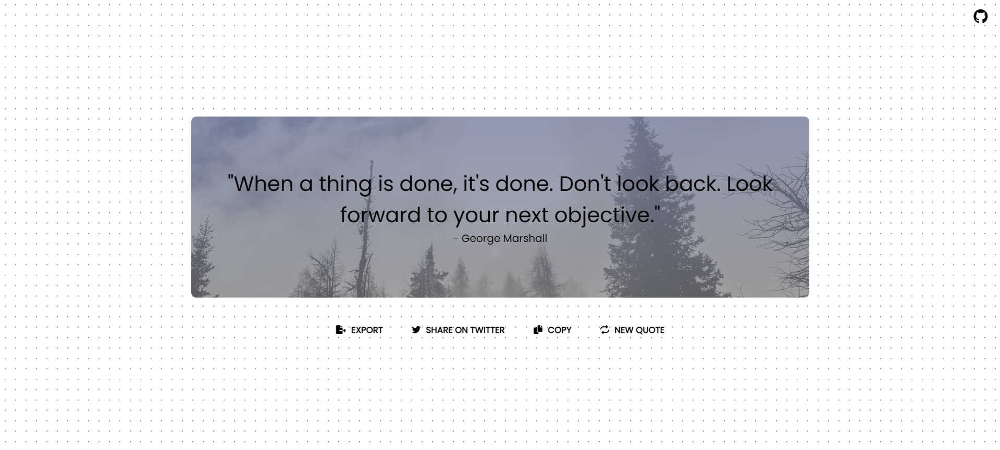
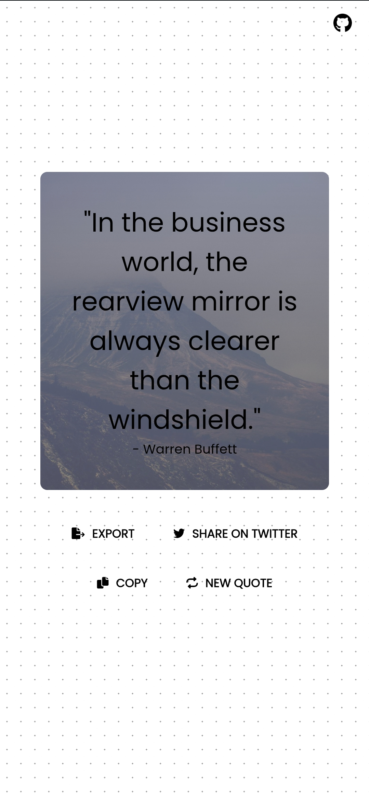
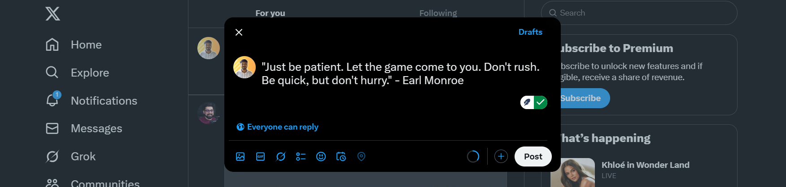

# 📜 Get Random Quotes
## 📝 Description
A simple web application that fetches random quotes from an API and provides additional features such as copying, sharing, and exporting quotes as images.

## ✨ Features
- 🎲 Fetches a random quote from the API.
- 📖 Displays the quote and author on the page.
- 🔄 "New Quote" button to fetch another quote.
- 📋 Copy to clipboard button. Copies the quote in to your clipboard.
- 🐦 Share on Twitter(X) button. It takes the quote directly to the Twitter post just have to hit post.
- 🌄 Sets a Random background image behind the quote. It works on page refresh. It takes 2-3s to load.
- 📥 Export feature to save the quote as an image.
- 📲 Fully functional and visually consistent across mobile and desktop devices.

## 🔗 API Endpoint
- [Random Quote API(freeapi.app)](https://freeapi.hashnode.space/api-guide/apireference/getARandomQuote)
- [Random Image API(Picsum)](https://picsum.photos/2000)

## 🌍 Deployment
The application is deployed and accessible at:
[Deployment Link](https://quotesplash.netlify.app/)

## 📸 Screenshots
### 💻 Desktop View:

### 📱 Mobible View:

### 🐦 Share on Twitter:

### 📋 Copy to Clipboard:

### ⬇️ Dwonloads/Export:

## 📬 Contact
For any queries, reach out at:
- **📧 Email:** meaniketdey@gmail.com
- **🐙 GitHub:** [AniketDey06](https://github.com/aniketdey06)

#
